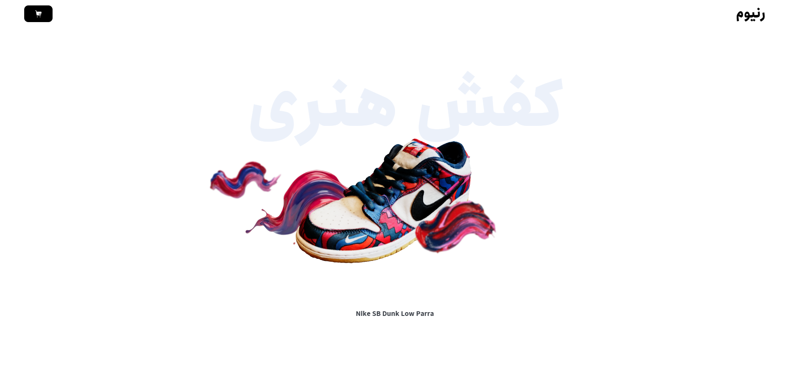
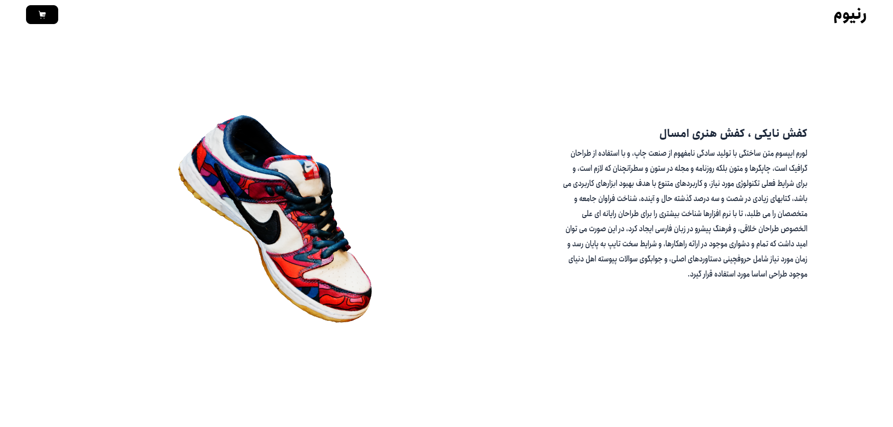
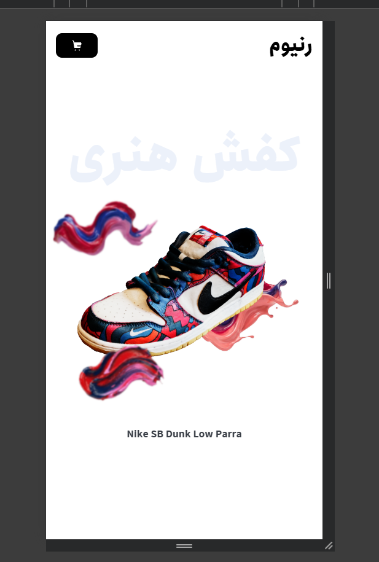

# 👟 Simple three.js Nike Shoe Landing Page

An interactive 3D product landing page featuring a Nike shoe model with smooth animations and scroll-triggered effects.

---

## 🎬 Demo

[Live Demo](#) *(coming soon)*

### Screenshots





---

## ✨ Features

### Current
- 🎯 Scroll-triggered animations with GSAP
<!-- - 📱 Responsive design -->
- ⚡ Optimized GLB model (WebP textures + Draco compression)

### Upcoming
- 🎨 Color customization - Let users pick their own shoe colors
- 💥 Exploded view - Parts separate to show details & specs
---

## 🛠️ Tech Stack

- **Three.js** - 3D rendering
- **GSAP** - Animations & ScrollTrigger
- **Vite** - Build tool
- **JavaScript** - Core logic

---

## 🚀 Getting Started

# Clone the repo
```
git clone https://github.com/Mr3DWeb/threejs-simple-nike-landing-fa.git
```
# Install dependencies
```
npm install
```
# Run dev server
```
npm run dev
```

## 📁 Project Structure
```
├── src/
│   └── main.js
├── static/
│   └── shoe.glb
├── index.html
├── style.css
└── package.json
```
---

## 📫 Contact

- 💼 [LinkedIn](https://www.linkedin.com/in/mr3dweb/)
- 📧 mr3dweb@gmail.com

---

Built with ☕ + Three.js + GSAP 💚
